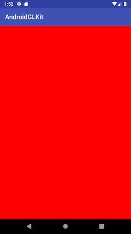
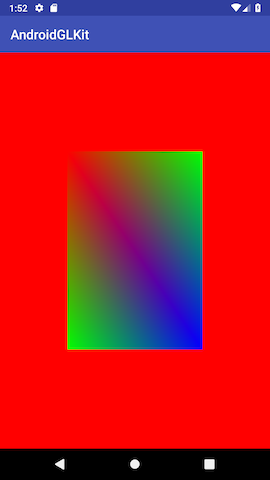
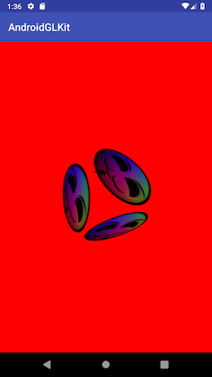
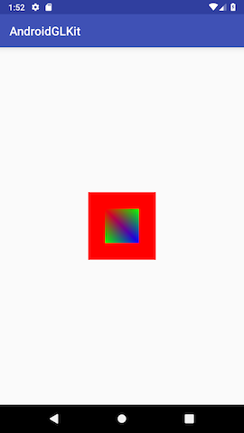

# AndroidGLKit

AndroidGLKit provides OpenGL ES 2.0 boilerplate codes for Android. You can implement OpenGL 2.0 things easyly by using AndroidGLKit. 


## How to Use

### Extends Activity or Fragment

AndroidGLKit provides GLKActivity or GLKFragments. Also it has  GLKAppCompatActivity and GLKSupportFragment. You can extends above activity or fragment like below.

```
public class TextureActivity extends GLKAppCompatActivity {
    @Override
    protected void onCreate(Bundle savedInstanceState) {
        super.onCreate(savedInstanceState);
    }

    @Override
    protected void onStart() {
        super.onStart();
        glkView.setGLKRenderer(new TextureRenderer(this));
    }
}
```

Notice that above code does not have set layout code `setContentView(R.layout.texture_activity)`. Because AndroidGLKit provides default layout file as `common_glk_view.xml` like below:

```
<?xml version="1.0" encoding="utf-8"?>
<kr.pe.burt.android.lib.androidglkit.GLKView
    xmlns:android="http://schemas.android.com/apk/res/android"
    android:id="@+id/glkView"
    android:layout_width="match_parent"
    android:layout_height="match_parent">

</kr.pe.burt.android.lib.androidglkit.GLKView>
```

If you extends activity or fragment that GLKit provides, you don't need to have layout file. 

### Custom Layout file

Of course, You don't like above approch. Therefore, You can use custom layout file like below:

```
public class SquareActivity extends GLKAppCompatActivity {

    @Override
    protected int getLayoutFileResourceId() {
        return R.layout.activity_square;
    }

    @Override
    protected void onStart() {
        super.onStart();
        glkView.setGLKRenderer(new SquareRenderer(this));
    }
}
```

Override `getLayoutFileResourceId` method and return resource id for your layout file. `R.layout.activity_square` looks like below:

```
<?xml version="1.0" encoding="utf-8"?>
<RelativeLayout xmlns:android="http://schemas.android.com/apk/res/android"
    xmlns:tools="http://schemas.android.com/tools"
    android:layout_width="match_parent"
    android:layout_height="match_parent"
    xmlns:glk="http://schemas.android.com/apk/res-auto"
    tools:context="kr.pe.burt.android.lib.androidglkit.app.SquareActivity">


    <kr.pe.burt.android.lib.androidglkit.GLKView
        android:id="@+id/glkView"
        android:layout_width="match_parent"
        android:layout_height="match_parent"
        />


</RelativeLayout>
```

Important thing is GLKView must have `android:id` as glkView. It is rule for using AndroidGLKit.

### Implement GLKRenderer

GLKRenderer takes responsibility for draw something on OpenGL ES Context. Maybe your opengl codes to be in here. The Simplest renderer is blank renderer like below:

```
public class BlankRenderer implements GLKRenderer {

    @Override
    public void init(GLKView view) {

    }

    @Override
    public void onSizeChanged(GLKView view, int width, int height) {
        GLES20.glViewport(0, 0, width, height);
    }

    @Override
    public void update(GLKView view, long dt) {
        GLES20.glClearColor(1.0f, 0.0f, 0.0f, 1.0f);
        GLES20.glClear(GLES20.GL_COLOR_BUFFER_BIT | GLES20.GL_DEPTH_BUFFER_BIT);
    }
}
```

### Set Renderer to GLKView

If you have implemented GLKRenderer, you should set it to GLKView like below:

```
@Override
public void onStart() {
    super.onStart();
    glkView.setGLKRenderer(new BlankRenderer());
}
```

That's it :) If you run the above code, You can see the result screen like below:



## Examples 

### Square



### Texture



### Offscreen Rendering



You can get bitmap from OpenGL ES context easily like below:

```
@Override
protected void onStart() {
    super.onStart();

    GLKPixelBuffer pb = new GLKPixelBuffer(300, 300);
    Bitmap bitmap = pb.getBitmap(new SquareRenderer(this));
    imageView.setImageBitmap(bitmap);
    pb.destroy();
}
```

Enjoy OpenGL ES 2.0 with AndroidGLKit!

## MIT License

The MIT License (MIT)

Copyright (c) 2016 Sungcheol Kim, [https://github.com/skyfe79/AndroidGLKit](https://github.com/skyfe79/AndroidGLKit)

Permission is hereby granted, free of charge, to any person obtaining a copy
of this software and associated documentation files (the "Software"), to deal
in the Software without restriction, including without limitation the rights
to use, copy, modify, merge, publish, distribute, sublicense, and/or sell
copies of the Software, and to permit persons to whom the Software is
furnished to do so, subject to the following conditions:

The above copyright notice and this permission notice shall be included in all
copies or substantial portions of the Software.

THE SOFTWARE IS PROVIDED "AS IS", WITHOUT WARRANTY OF ANY KIND, EXPRESS OR
IMPLIED, INCLUDING BUT NOT LIMITED TO THE WARRANTIES OF MERCHANTABILITY,
FITNESS FOR A PARTICULAR PURPOSE AND NONINFRINGEMENT. IN NO EVENT SHALL THE
AUTHORS OR COPYRIGHT HOLDERS BE LIABLE FOR ANY CLAIM, DAMAGES OR OTHER
LIABILITY, WHETHER IN AN ACTION OF CONTRACT, TORT OR OTHERWISE, ARISING FROM,
OUT OF OR IN CONNECTION WITH THE SOFTWARE OR THE USE OR OTHER DEALINGS IN THE
SOFTWARE.


